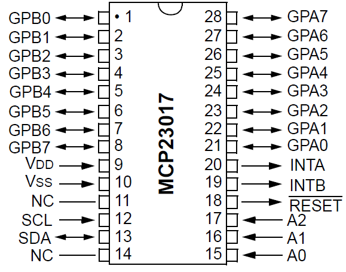

## Impaired Home Automation

Advanced Studio Project @ AIT

6201 Mohammed Tantawy - 6678 Davide Bragagnolo

### Smart Lights System

in order to run the Smart Lights, you must have:

- an ESP8266 (with interface to program it with Arduino IDE)
- an MCP23017
- some leds
- replace the SSID user and password with your wifi details

the smart lights answer to the address `http://<your_esp8266_ip>`

### Commands for IHA Project

This project has been created for a project during our Bachelor of IT course. This is intended to be used with the [IHA Robot](https://github.com/imphomeauto/robot-wheelchair)

open the browser to:
- `http://your_esp8266_ip/` to get the lights status
- `http://your_esp8266_ip/on/{n}` to turn on specific light, replace `{n}` with:
    - 0 for ENTRANCE
    - 2 for TOILET
    - 4 for BEDROOM
    - 6 for KITCHEN
- `http://your_esp8266_ip/off/{n}` to turn off specific light
- `http://your_esp8266_ip/onall` to turn on all lights
- `http://your_esp8266_ip/offall` to turn off all lights

### The ESP8266 and MCP23017

The MCP23017 is a GPIO expander with i2c interface, in this way I can turn on/off up to 16 lights.

The interface use HTTP GET requests, and output a JSON document with the operation and lights status.

#### Detals

- include the [Adafruit MCP23017](https://github.com/adafruit/Adafruit-MCP23017-Arduino-Library) library if you use the Adafruit ESP8266, or [my fork](https://github.com/davebra/Adafruit-MCP23017-Arduino-Library) if you use a generic ESP8266 and you need to change the gpio for Wire.h class
- set your network ssid and password
- open the browser to:
    - `http://your_esp8266_ip/` to get the status
    - `http://your_esp8266_ip/on/2` to turn on (set HIGH) MCP23017 port number 2 (you can use 0 to 15)
    - `http://your_esp8266_ip/off/3` to turn on (set HIGH) MCP23017 port number 3 (you can use 0 to 15)

#### Connections (after deploy, generic ESP8266)

- esp8266 VCC -> 3.3v
- esp8266 GND -> GND
- esp8266 gpio0 -> MCP23017 pin13
- esp8266 gpio2 -> MCP23017 pin12
- MCP23017 pin9 -> 3.3v
- MCP23017 pin8 -> GND
- MCP23017 pin15 -> GND
- MCP23017 pin16 -> GND
- MCP23017 pin17 -> GND
- MCP23017 pin18 -> 3.3v

#### MCP23017 pins

#### MCP23017 Lights mapping

- MCP23017 pin21 -> light 0 (ENTRANCE for IHA Project)
- MCP23017 pin22 -> light 1
- MCP23017 pin23 -> light 2 (TOILET for IHA Project)
- MCP23017 pin24 -> light 3
- MCP23017 pin25 -> light 4 (BEDROOM for IHA Project)
- MCP23017 pin26 -> light 5
- MCP23017 pin27 -> light 6 (KITCHEN for IHA Project)
- MCP23017 pin28 -> light 7
- MCP23017 pin1 -> light 8
- MCP23017 pin2 -> light 9
- MCP23017 pin3 -> light 10
- MCP23017 pin4 -> light 11
- MCP23017 pin5 -> light 12
- MCP23017 pin6 -> light 13
- MCP23017 pin7 -> light 14
- MCP23017 pin8 -> light 15
